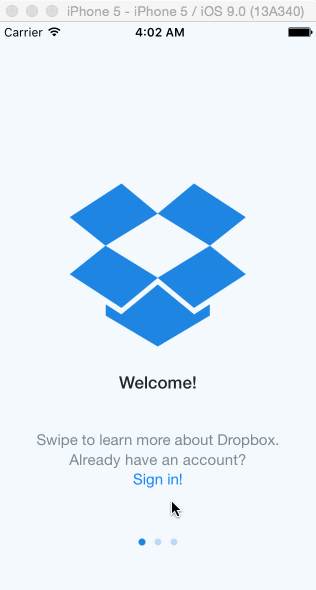

# MyDropboxApp for Codepath

This application is an exercise to complete the dropbox application to Codepath's iOS for Designers course. 

Time spent: 11.5 hours

## What does the app can do?

This is an implementation of the Swift dropbox app by following Week1 lab exercises and courses by CodePath.

* [x] Required: User can tap through the 3 welcome screens. User can follow the create user flow.
* [x] Required: On the create user form, the user can tap the back button to go to the page where they can sign in or create an account.
* [x] Required: Before creating the account, user can choose to read the terms of service.
* [x] Required: After creating the account, user can view the placeholders for Files, Photos, and Favorites as well as the Settings screen.
* [x] Required: User can log out from the Settings screen.
* [x] Required: User can follow the sign in flow.
* [x] Required: User can tap the area for "Having trouble signing in?"
* [x] Required: User can log out from the Settings screen.

## What's different/open issues

- Error while using navigationController!.popViewControllerAnimated(true).
- Tab bar controller not showing the the settings view controller

## Credit
GIF created with [LICEcap](http://www.cockos.com/licecap/).
